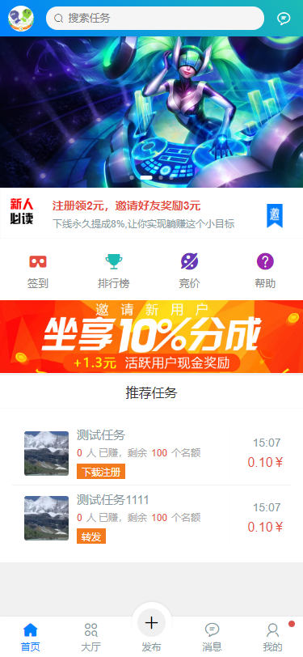
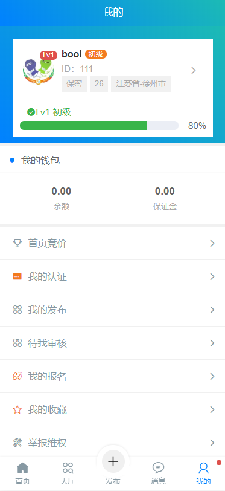

趣味赚 基于 uniapp +tp6
===============
> 运行环境要求 ThinkPHP 6.0

> 运行环境要求 PHP7.1+

> 运行环境要求 MongoDB 4.0.10

---

支持生成 h5 安卓 ios 微信小程序 支付宝小程序 百度小程序 字节跳动 等

## 注：账号 密码 随便 填写

### 演示地址
http://148.70.120.105/#/

[演示地址](http://148.70.120.105/#/) 

## 安装

~~~
composer create-project topthink/think tp 6.0.*-dev
~~~

如果需要更新框架使用
~~~
composer update topthink/framework
~~~

消息推送
~~~
php think worker:gateway
~~~

## APP下载  (.apk)
==注: 暂时只提供安卓版 下载==

网盘 | 地址 | 密码 
---|---|---
90网盘 | https://www.90pan.com/b1586253 | av08
城通网盘 | https://t00y.com/file/23130714-415425690 | 无

## 演示

    
  

    
  

    
  

    
  

