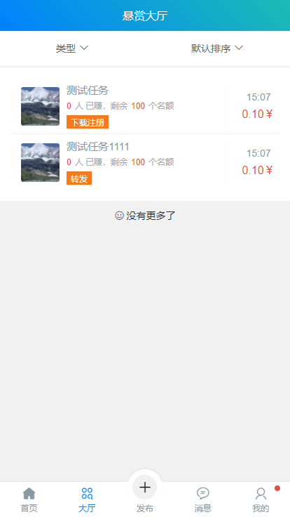

趣味赚
===============
> 运行环境要求 ThinkPHP 6.0

> 运行环境要求 PHP7.1+

> 运行环境要求 MongoDB 4.0.10

---

## 注：账号 密码 随便 填写

### 演示地址
http://148.70.120.105/#/

[演示地址](http://148.70.120.105/#/) 

## 安装

~~~
composer create-project topthink/think tp 6.0.*-dev
~~~

如果需要更新框架使用
~~~
composer update topthink/framework
~~~

消息推送
~~~
php think worker:gateway
~~~

## 演示

